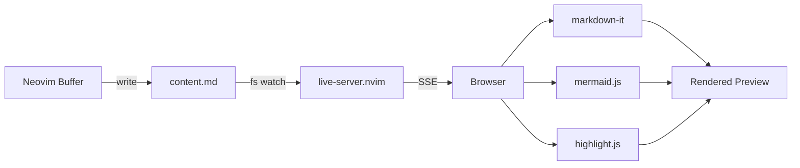

# markdown-preview.nvim

> **Note:** This repository was previously known as `mermaid-playground.nvim`. It has been renamed and rewritten to support full Markdown preview alongside first-class Mermaid diagram support.

Live **Markdown preview** for Neovim with first-class **Mermaid diagram** support.

- Renders your entire `.md` file in the browser — headings, tables, code blocks, everything
- **Relative images work** — paths are resolved from the `.md` file and may use `..` while remaining inside Neovim's `:pwd`
- **Mermaid diagrams** render inline as interactive SVGs (click to expand, zoom, pan, export)
- **Initial position restore** — opens at the current Markdown line without following later cursor movement
- **Instant updates** via Server-Sent Events (no polling), with optional continuous **scroll sync**
- **Click-to-Neovim** — click a rendered Markdown block to scroll its Neovim instance to the source
- **LaTeX math** — inline `$...$` and display `$$...$$` rendered via KaTeX
- **Syntax highlighting** for code blocks (highlight.js)
- Automatic Dark / Light theme following the system color scheme
- **Zero external dependencies** — no npm, no Node.js, just Neovim + your browser
- Powered by [`live-server.nvim`](https://github.com/selimacerbas/live-server.nvim) (pure Lua HTTP server)

---

## Quick start

### Install (lazy.nvim)

```lua
{
  "selimacerbas/markdown-preview.nvim",
  dependencies = { "selimacerbas/live-server.nvim" },
  config = function()
    require("markdown_preview").setup({
      -- all optional; sane defaults shown
      instance_mode = "multi",     -- default: one previewer per Neovim instance
      port = 0,                    -- 0 = auto (8421 for takeover, OS-assigned for multi)
      open_browser = true,
      default_theme = "auto",      -- follow the OS; "dark" or "light" forces a theme
      debounce_ms = 300,
    })
  end,
}
```

No prereqs. No `npm install`. Just install and go.

### Use it

Open any Markdown file, then:

- **Start preview:** `:MarkdownPreview`
- **Edit freely** — the browser updates instantly as you type
- **Force refresh:** `:MarkdownPreviewRefresh`
- **Stop:** `:MarkdownPreviewStop`

> The first start opens your browser. Subsequent updates reuse the same tab.

**`.mmd` / `.mermaid` files** are fully supported — the entire file is rendered as a diagram.

For **other non-markdown files**, place your cursor inside a fenced ```` ```mermaid ```` block — the plugin extracts and previews just that diagram.

---

## Commands

| Command                  | Description          |
|--------------------------|----------------------|
| `:MarkdownPreview`       | Start preview        |
| `:MarkdownPreviewRefresh`| Force refresh        |
| `:MarkdownPreviewStop`   | Stop preview         |

No keymaps are set by default — map them however you like. Suggested:

```lua
vim.keymap.set("n", "<leader>mps", "<cmd>MarkdownPreview<cr>", { desc = "Markdown: Start preview" })
vim.keymap.set("n", "<leader>mpS", "<cmd>MarkdownPreviewStop<cr>", { desc = "Markdown: Stop preview" })
vim.keymap.set("n", "<leader>mpr", "<cmd>MarkdownPreviewRefresh<cr>", { desc = "Markdown: Refresh preview" })
```

---

## Browser UI

The preview opens a polished browser app with:

- **Full Markdown rendering** — GitHub-flavored styling with colored heading borders, lists, tables, blockquotes, code, images, links, horizontal rules
- **Syntax-highlighted code blocks** — powered by highlight.js, with language badges
- **Interactive Mermaid diagrams** — rendered inline as SVGs:
  - Hover a diagram to reveal the **expand button**
  - Click to open a **fullscreen overlay** with touch/pointer/wheel zoom, pan, and SVG export
- **Dark / Light theme** follows the system color scheme automatically
- **Structured front matter** — YAML metadata renders as a collapsible, expandable JSON tree
- **Per-diagram error handling** — if one mermaid block is invalid, only that block shows an error; the rest of the page renders fine
- **LaTeX math rendering** — `$E = mc^2$` inline and `$$\int_0^\infty$$` display math via KaTeX, plus `\begin{equation}` environments
- **Scroll sync** — browser follows your cursor position with line-level precision
- **Iconify auto-detection** — icon packs like `logos:google-cloud` are loaded on demand

---

## Configuration

```lua
require("markdown_preview").setup({
  instance_mode = "multi",              -- "multi" (default) or "takeover" (see below)
  port = 0,                             -- 0 = auto (8421 for takeover, OS-assigned for multi)
  host = "127.0.0.1",                   -- bind address; "0.0.0.0" for network access (see Remote access)
  open_browser = true,                  -- auto-open browser on start

  -- nil = system default browser
  -- string = browser name ("Firefox") or binary ("google-chrome")
  -- table = full command, URL appended ({ "google-chrome", "--incognito" })
  -- On macOS, string values are passed via `open -a <name>`.
  browser = nil,

  content_name = "content.md",          -- workspace content file
  index_name = "index.html",            -- workspace HTML file
  -- One CSS path, or an ordered list. Later files win the cascade.
  custom_css = {
    vim.fs.joinpath(vim.fn.stdpath("config"), "css", "theme.css"),
    vim.fs.joinpath(vim.fn.stdpath("config"), "css", "highlight.css"),
  },
  workspace_dir = nil,                  -- nil = auto (shared for takeover, per-buffer for multi)

  overwrite_index_on_start = true,      -- copy plugin's index.html on every start

  auto_refresh = true,                  -- auto-update on buffer changes
  auto_refresh_events = {               -- which events trigger refresh
    "InsertLeave", "TextChanged", "TextChangedI", "BufWritePost"
  },
  debounce_ms = 300,                    -- debounce interval
  notify_on_refresh = false,            -- show notification on refresh

  -- After the first :MarkdownPreview, reuse its server/browser tab when
  -- entering another Markdown buffer. Other filetypes leave it unchanged.
  follow_current_buffer = false,

  default_theme = "auto",               -- follow the OS; "dark" or "light" forces a theme

  yaml_mode = "panel",                  -- front matter: "panel" (collapsible above preview), "hide", or "raw"

  allow_raw_html = true,                -- render raw HTML in markdown; set false for untrusted files (see Security)

  initial_scroll = true,                -- scroll to current line once when opening/retargeting
  scroll_sync = false,                  -- opt in: continuously follow Neovim's cursor
  click_to_nvim = true,                 -- click a rendered block to scroll Neovim

  -- Fraction (0–1): vertical position of the final line when scrolled to end.
  -- 0.5 = middle of viewport (default), 1.0 = bottom edge (no extra space)
  bottom_padding = 0.5,

  hooks = {
    on_start = nil,   -- fun(url: string)|nil — called after preview starts
    on_stop  = nil,   -- fun()|nil — called after preview stops
  },
})
```

`click_to_nvim` applies to the default `multi` mode, where each previewer has exactly one corresponding Neovim instance.

### Hooks

Lifecycle callbacks that run when the preview starts or stops. Use them for notifications, logging, or triggering other actions.

```lua
require("markdown_preview").setup({
  hooks = {
    on_start = function(url)
      vim.notify("Preview started: " .. url, vim.log.levels.INFO)
    end,
    on_stop = function()
      vim.notify("Preview stopped", vim.log.levels.INFO)
    end,
  },
})
```

- **`on_start(url)`** — called after the server is ready, before the browser opens. Receives the preview URL as a string.
- **`on_stop()`** — called after the server is stopped and all cleanup is done.

### Remote access (SSH)

If you're running Neovim on a remote machine over SSH and want to view the preview on your local machine, bind to all interfaces and use `on_start` to print the URL:

```lua
require("markdown_preview").setup({
  host = "0.0.0.0",
  open_browser = false,
  hooks = {
    on_start = function(url)
      vim.notify("Markdown Preview: " .. url, vim.log.levels.INFO)
    end,
  },
})
```

The notification will show the full URL including the auth token (e.g. `http://10.0.0.5:8421/?t=...`). Most terminals support **Ctrl+Shift+click** on the URL to open it directly in your local browser.

> **Security notes for network binding**
>
> - With a non-loopback `host`, the tokenized URL is required for *everything*, including the page itself — requests without `?t=<token>` get 401. Peers on your network cannot read your buffer without the URL.
> - Traffic is plain, unencrypted HTTP. Anyone who obtains the URL (or can sniff the local network) can read the previewed buffer while the preview runs.
> - Takeover mode supports `host = "127.0.0.1"` or `"0.0.0.0"` only. To bind a specific interface, use `instance_mode = "multi"`.
> - Zero-config alternative: keep the default loopback bind and tunnel instead — `ssh -L 8421:localhost:8421 <remote>` — then open the URL printed by `on_start` locally, replacing the host with `127.0.0.1`. Nothing is exposed to the network, and traffic is encrypted by SSH.

### Instance modes

**Takeover** — all Neovim instances share a single workspace and browser tab. The first instance to run `:MarkdownPreview` becomes the primary (starts the server on port 8421). Subsequent instances become secondaries — they write content to the shared workspace, and the server's file watcher pushes a reload to the browser. Scroll sync works across instances via HTTP event injection.

**Multi** (default) — each Neovim instance gets its own server on an OS-assigned port and its own previewer. With `follow_current_buffer = true`, that server and browser tab retarget when you enter another Markdown buffer.

```lua
require("markdown_preview").setup({ instance_mode = "multi" })
```

---

## Example



---

## How it works

```
Neovim buffer
    |
    |  (autocmd: debounced write)
    v
workspace/content.md
    |
    |  (live-server.nvim detects change)
    v
SSE event --> Browser
    |
    |  markdown-it --> HTML
    |  mermaid.js  --> inline SVG diagrams
    |  highlight.js --> syntax highlighting
    |  morphdom    --> efficient DOM diffing
    v
Rendered preview (scroll preserved, no flicker)
```

- **Markdown files**: The entire buffer is written to `content.md`
- **Mermaid files** (`.mmd`, `.mermaid`): The entire buffer is wrapped in a mermaid code fence
- **Other files**: The mermaid block under the cursor is extracted (via Tree-sitter or regex fallback) and wrapped in a code fence
- **SSE** (Server-Sent Events) from `live-server.nvim` push updates instantly — no polling
- **morphdom** diffs the DOM efficiently, preserving scroll position and interactive state
- **Takeover mode** shares a single workspace (`~/.cache/nvim/markdown-preview/shared/`) and browser tab across all Neovim instances via a lock file
- **Multi mode** uses per-buffer workspaces under `~/.cache/nvim/markdown-preview/<hash>/`; one server per Neovim instance retargets between them

---

## Dependencies

- **Neovim** 0.9+
- **[live-server.nvim](https://github.com/selimacerbas/live-server.nvim)** — pure Lua HTTP server (no npm)
- **Tree-sitter** with the **Markdown** parser (recommended for mermaid block extraction)

Browser-side libraries are loaded from CDN (cached by your browser):
- [markdown-it](https://github.com/markdown-it/markdown-it) — Markdown parser
- [DOMPurify](https://github.com/cure53/DOMPurify) — browser-side HTML/SVG/MathML sanitization
- [KaTeX](https://katex.org/) + [markdown-it-texmath](https://github.com/goessner/markdown-it-texmath) — LaTeX math rendering
- [Mermaid](https://mermaid.js.org/) — diagram engine
- [Panzoom](https://github.com/timmywil/panzoom) — touch, pointer, and wheel zoom for expanded diagrams
- [highlight.js](https://highlightjs.org/) — syntax highlighting
- [morphdom](https://github.com/patrick-steele-idem/morphdom) — DOM diffing
- [yaml](https://eemeli.org/yaml/) — on-demand browser-side front matter parsing
- [renderjson-2](https://github.com/rtritto/renderjson-2) — compact, expandable front matter tree

---

## Security

- **Local by default.** The preview server binds to `127.0.0.1`. Your buffer content (`content.md`), the SSE stream, and the event-injection endpoint all require a per-session 128-bit token; with a non-loopback `host`, the preview page itself requires it too (see *Remote access* above).
- **Raw HTML is rendered by default** (GitHub-like), but the rendered result is sanitized in the browser by DOMPurify before it enters the DOM. Common layout HTML, images, SVG, SVG filters, MathML, and `data-*` attributes are preserved; scripts, event handlers, and dangerous URLs are removed. If DOMPurify cannot load, raw HTML fails closed and is rendered as text. Set `allow_raw_html = false` to disable raw HTML entirely.
- **Browser libraries load from CDNs** (jsdelivr/unpkg, see *Dependencies*). Nothing from your machine is sent to them, but rendering requires internet access. Vendoring the assets locally is planned ([#27](https://github.com/selimacerbas/markdown-preview.nvim/issues/27)).
- **`custom_css` files are inlined into the preview page** verbatim. Point it only at files you trust.
- **Relative assets are bounded by Neovim's `:pwd` by default.** Paths are resolved from the previewed Markdown file, so `../images/pic.png` works when its final real path remains inside `:pwd`. The token-gated asset route can serve *any* file inside that boundary (not just images). If the Markdown file is outside `:pwd`, the boundary safely falls back to the file's own directory. Symlinks are checked by final real path and cannot escape the boundary. Keep sensitive files such as `.env` out of the active project tree when binding to a non-loopback host, or prefer an SSH tunnel.
- The takeover-mode lock file (which contains the session token) is written with mode `0600`.

---

## Troubleshooting

**WSL: browser doesn't open, or preview unreachable from Windows**
- The plugin tries `wslview`, `explorer.exe`, then `powershell.exe` to open your Windows browser. Installing [wslu](https://wslutiliti.es/wslu/) (`sudo apt install wslu`) is the most reliable option; you can also set `browser = "wslview"` explicitly.
- If no launcher works, a notification shows the preview URL — open it manually in your Windows browser.
- If `http://127.0.0.1:8421/` is unreachable from Windows, WSL2's localhost forwarding has likely broken (common after sleep, hibernate, or VPN changes). Run `wsl --shutdown` from PowerShell and reopen WSL. Alternatively bind the server to all interfaces (`host = "0.0.0.0"`) and open the URL printed by `hooks.on_start` (see *Remote access*).
- `explorer.exe`/`powershell.exe` require Windows interop; check `/etc/wsl.conf` for `[interop] enabled=false` or `appendWindowsPath=false`.

**Images don't show**
- Relative paths (`pic.png`, `images/pic.png`, `../shared/pic.png`) are resolved from the directory of the file being previewed. The final real path must remain inside the current Neovim `:pwd`; run `:pwd` to inspect that boundary and `:cd /path/to/project` to change it before starting or refreshing the preview.
- Relative image destinations use the browser's standard URL parser, so leading `./`, `.`/`..` normalization, raw Unicode mixed with escapes such as `%20`, and encoded filename characters such as `%23`, `%25`, and `%2B` are supported. URL query strings and fragments are not treated as part of the filename.
- A literal percent sign in a Markdown URL must be written as `%25`. Malformed percent escapes and paths that cross the `:pwd` boundary are rejected instead of being guessed.
- If the Markdown file is outside `:pwd`, access falls back to the Markdown file's own directory rather than widening to an unrelated working directory.
- Absolute filesystem paths (`/home/me/pic.png`) are not supported; http(s) URLs load as usual.

**Browser shows nothing or "Loading..."**
- Make sure `live-server.nvim` is installed and loadable: `:lua require("live_server")`
- Check the port isn't in use: change `port` in config

**Mermaid diagram not rendering**
- The diagram syntax must be valid Mermaid — check the error chip on the diagram block
- Invalid diagrams show the last good render + error message

**Port conflict**
- In takeover mode, stop the other instance first or change the port: `port = 9999`
- In multi mode, ports are auto-assigned — conflicts shouldn't happen

**Stale lock file (takeover mode)**
- If Neovim crashes, the lock file may persist. The next `:MarkdownPreview` detects the dead server and automatically takes over

---

## Testing

- `tests/token_auth_test.lua` covers the Neovim lifecycle, token-protected HTTP routes, relative asset boundaries, buffer following, and cleanup.
- Open `tests/browser_test.html` directly in a browser for browser-side checks. They run automatically and report a green or red status for each dependency; no Node installation or downloaded test browser is required.

---

## Project structure

```
markdown-preview.nvim/
├─ plugin/markdown-preview.lua       -- commands
├─ lua/markdown_preview/
│  ├─ init.lua                       -- main logic (server, refresh, workspace, instance modes)
│  ├─ util.lua                       -- fs helpers, workspace resolution
│  ├─ ts.lua                         -- Tree-sitter mermaid extractor + fallback
│  ├─ lock.lua                       -- lock file management (takeover mode coordination)
│  └─ remote.lua                     -- HTTP event injection (secondary scroll sync)
└─ assets/
   └─ index.html                     -- browser preview app
```

---

## Thanks

- [Mermaid](https://mermaid.js.org/) for the diagram engine
- [Iconify](https://iconify.design/) for icon packs
- [markdown-it](https://github.com/markdown-it/markdown-it) for Markdown parsing
- [highlight.js](https://highlightjs.org/) for syntax highlighting
- [morphdom](https://github.com/patrick-steele-idem/morphdom) for efficient DOM updates

PRs and ideas welcome!
